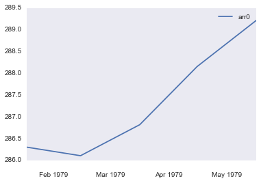
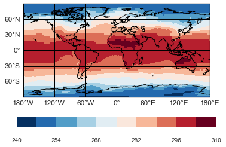

.. _gallery_examples_example_cdo.ipynb:

Usage of Climate Data Operators
===============================

This example shows you how CDOs are binded in the psyplot package

.. code:: python

    
    import logging
    logging.captureWarnings(True)
    logging.getLogger('py.warnings').setLevel(logging.ERROR)

.. code:: python

    import psyplot.project as psy

.. code:: python

    cdo = psy.Cdo()
    lines = cdo.fldmean(input='-sellevidx,1 demo.nc', returnLine='t2m')
    lines.update(xticks='month', xticklabels='%b %Y')

.. code:: python

    maps = cdo.timmean(input='demo.nc', returnMap='t2m')
    maps.update(cmap='RdBu_r')

.. code:: python

    psy.gcp(True).close(True, True)

.. only:: html

    .. container:: sphx-glr-download

        **Download python file:** :download:`example_cdo.py`

        **Download IPython notebook:** :download:`example_cdo.ipynb`

.. only:: html

    .. container:: sphx-glr-download

        **Download supplementary data:** :download:`demo.nc`
