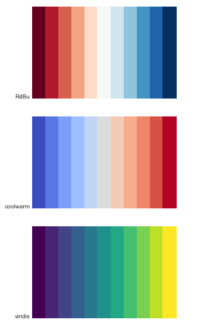
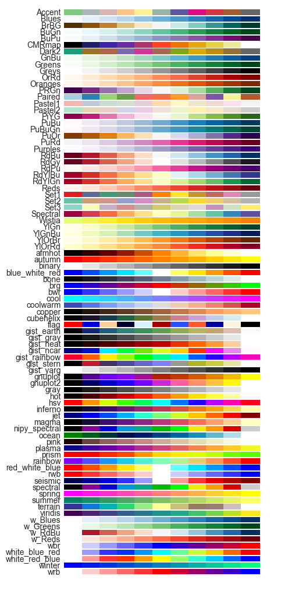

.. _gallery_examples_example_colormaps.ipynb:

Available colormaps
===================

This example shows you how you can explore your colormaps

It uses the ``psyplot.plotter.colors.show_colormaps`` function and can
visualize all, selected, or your own colormaps.

.. code:: python

    import psyplot.project as psy

You can either visualize specific colormaps

.. code:: python

    psy.show_colormaps('RdBu', 'coolwarm', 'viridis')

display your own ones

.. code:: python

    import matplotlib.colors as mcol
    cmap = mcol.LinearSegmentedColormap.from_list(
        'my_cmap', [[1, 0, 0], [0, 1, 0], [0, 0, 1]], N=11)
    psy.show_colormaps(cmap)

or all that are avaiable

.. code:: python

    psy.show_colormaps()

Those colormaps (or their name) can then be used for the ``cmap``
formatoption or the ``color`` formatoption.

.. only:: html

    .. container:: sphx-glr-download

        **Download python file:** :download:`example_colormaps.py`

        **Download IPython notebook:** :download:`example_colormaps.ipynb`
