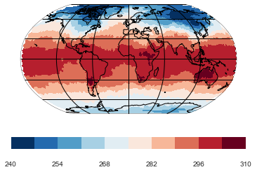
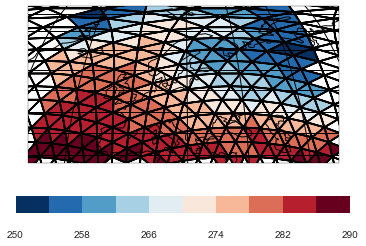
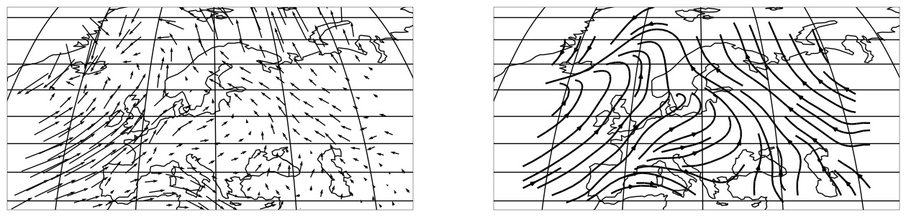
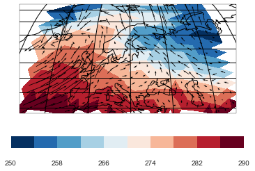

.. _gallery_examples_plotter_maps_example_icon.ipynb:

Visualizing unstructured data
=============================

Demo script to show all basic plot types on the map.

This example requires the file ``'icon_grid_demo.nc'`` which contains
one variable for the temperature, one for zonal and one for the
meridional wind direction.

.. code:: python

    import psyplot.project as psy

The visualization works the same way as for a usual rectangular grid. We
furthermore choose a robinson projection and a colormap ranging from
blue to red.

.. code:: python

    maps = psy.plot.mapplot('icon_grid_demo.nc', name='t2m', projection='robin', 
                            cmap='RdBu_r')

To display the data grid, we can use the ``datagrid`` formatoption. We
furthermore restrict ourselves to ``Europe`` for this visualization.

.. code:: python

    maps.update(lonlatbox='Europe', datagrid='k-')
    maps.show()

The same works for vector data

.. code:: python

    vectors = psy.plot.mapvector(
        'icon_grid_demo.nc', name=[['u', 'v']] * 2, projection='robin', 
        ax=(1, 2), lonlatbox='Europe')
    vectors[0].update(arrowsize=100)
    vectors[1].update(plot='stream')

And combined scalar and vector fields

.. code:: python

    combined = psy.plot.mapcombined(
        'icon_grid_demo.nc', name=[['t2m', ['u', 'v']]], projection='robin',
        lonlatbox='Europe', arrowsize=100, cmap='RdBu_r')

.. code:: python

    psy.gcp(True).close(True, True)

.. only:: html

    .. container:: sphx-glr-download

        **Download python file:** :download:`example_icon.py`

        **Download IPython notebook:** :download:`example_icon.ipynb`

.. only:: html

    .. container:: sphx-glr-download

        **Download supplementary data:** :download:`icon_grid_demo.nc`
