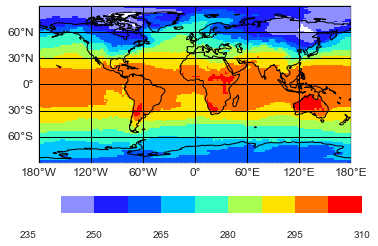
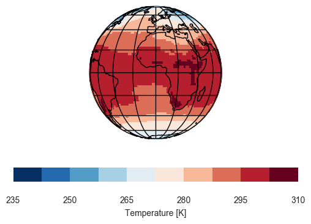
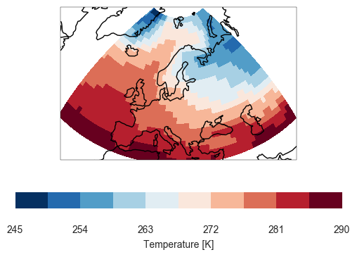
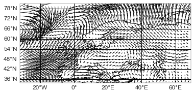
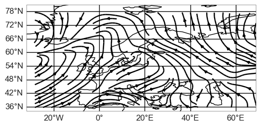
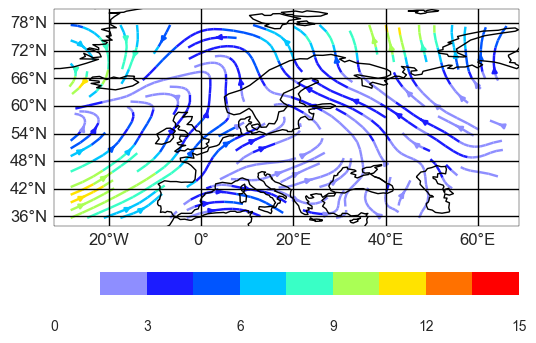
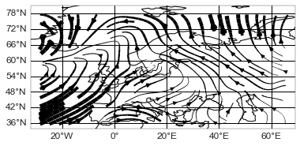
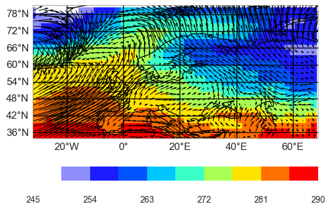
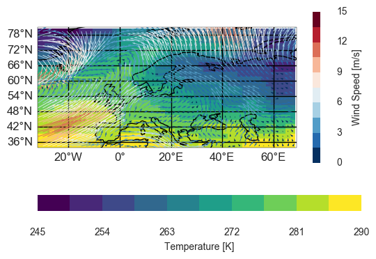
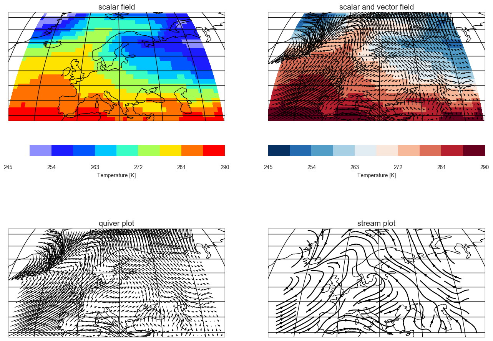

.. _gallery_examples_plotter_maps_example_mapplotters.ipynb:

Basic data visualization on a map
=================================

Demo script to show all basic plot types on the map.

This example requires the file ``'demo.nc'`` which contains one variable
for the temperature, one for zonal and one for the meridional wind
direction.

.. code:: python

    import psyplot.project as psy
    # we show the figures after they are drawn or updated. This is useful for the 
    # visualization in the ipython notebook
    psy.rcParams['auto_show'] = True

Visualizing scalar fields
-------------------------

The *mapplot* method visualizes scalar data on a map.

.. code:: python

    maps = psy.plot.mapplot('demo.nc', name='t2m')

To show the colorbar label we can use the *clabel* formatoption keyword
and use one of the predefined labels. Furthermore we can use the *cmap*
formatoption to see one of the many available colormaps

.. code:: python

    maps.update(clabel='{desc}', cmap='RdBu_r')

.. image:: images/example_mapplotters_1.png

Especially useful formatoption keywords are

-  projection: To modify the projection on which we draw
-  lonlatbox: To select only a specific slice
-  xgrid and ygrid: to disable, enable or modify the latitude-longitude
   grid

To use an orthogonal projection, we change the projection keyword to

.. code:: python

    maps.update(projection='ortho')

To focus on Europe and disable the latitude-longitude grid, we can set

.. code:: python

    maps.update(lonlatbox='Europe', xgrid=False, ygrid=False)

There are many more formatoption keys that you can explore in the
online-documentation or via

.. code:: python

    psy.plot.mapplot.keys(grouped=True)

.. parsed-literal::

    *********************
    Masking formatoptions
    *********************
    +-------------+-------------+-------------+-------------+
    | maskgreater | maskbetween | maskless    | maskleq     |
    +-------------+-------------+-------------+-------------+
    | maskgeq     |             |             |             |
    +-------------+-------------+-------------+-------------+
    
    ***************************
    Miscallaneous formatoptions
    ***************************
    +----------------+----------------+----------------+----------------+
    | lsm            | projection     | grid_color     | map_extent     |
    +----------------+----------------+----------------+----------------+
    | datagrid       | grid_labelsize | grid_labels    | ygrid          |
    +----------------+----------------+----------------+----------------+
    | clon           | lonlatbox      | transform      | grid_settings  |
    +----------------+----------------+----------------+----------------+
    | clat           | xgrid          |                |                |
    +----------------+----------------+----------------+----------------+
    
    ***********************
    Axis tick formatoptions
    ***********************
    +-------------+-------------+
    | cticks      | cticklabels |
    +-------------+-------------+
    
    **************************
    Color coding formatoptions
    **************************
    +-------------+-------------+-------------+-------------+
    | miss_color  | extend      | cbarspacing | ctickprops  |
    +-------------+-------------+-------------+-------------+
    | ctickweight | bounds      | cticksize   | cmap        |
    +-------------+-------------+-------------+-------------+
    | cbar        |             |             |             |
    +-------------+-------------+-------------+-------------+
    
    ******************
    Axes formatoptions
    ******************
    +-------+
    | tight |
    +-------+
    
    *******************
    Label formatoptions
    *******************
    +----------------+----------------+----------------+----------------+
    | clabelsize     | clabelweight   | clabelprops    | clabel         |
    +----------------+----------------+----------------+----------------+
    | figtitlesize   | titlesize      | title          | text           |
    +----------------+----------------+----------------+----------------+
    | figtitleweight | titleweight    | figtitleprops  | figtitle       |
    +----------------+----------------+----------------+----------------+
    | titleprops     |                |                |                |
    +----------------+----------------+----------------+----------------+
    
    ******************
    Plot formatoptions
    ******************
    +------+
    | plot |
    +------+

.. code:: python

    maps.close()  # we close the project because we create other figures below

Visualizing vector data
-----------------------

The *mapvector* method can visualize vectorized data on a map. But note
that it needs a list in a list list to make the plot, where the first
variable (here ``'u'``) is the wind component in the x- and the second
(here ``'v'``) the wind component in the y-direction.

.. code:: python

    mapvectors = psy.plot.mapvector('demo.nc', name=[['u', 'v']], lonlatbox='Europe', 
                                    arrowsize=100)

The plotter supports all formatoptions that the *mapplot* method
supports. The *plot* formatoption furthermore supplies the ``'stream'``
value in order to make a streamplot

.. code:: python

    mapvectors.update(plot='stream', arrowsize=None)

and we have two possibities to visualize the strength of the wind,
either via the color coding

.. code:: python

    mapvectors.update(color='absolute')

or via the linewidth

.. code:: python

    mapvectors.update(color='k', linewidth=['absolute', 0.5])

The second number for the linewidth scales the linewidth of the arrows,
where the default number is 1.0

.. code:: python

    mapvectors.close()

Visualizing combined scalar and vector data
-------------------------------------------

The *mapcombined* method can visualize a scalar field (here temperature)
with overlayed vector field. This method needs 3 variables: one for the
scalar field and two for the wind fields. The calling format is

.. code:: python

    psy.plot.mapcombined(filename, name=[['<scalar variable name>', ['<x-vector>', '<y-vector>']]])

.. code:: python

    maps = psy.plot.mapcombined('demo.nc', name=[['t2m', ['u', 'v']]], lonlatbox='Europe', 
                                arrowsize=100)

We can also modify the color coding etc. here, but all the formatoptions
that affect the vector color coding start with ``'v'``

.. code:: python

    psy.plot.mapcombined.keys('colors')

.. parsed-literal::

    +--------------+--------------+--------------+--------------+
    | vcticksize   | color        | vbounds      | vctickprops  |
    +--------------+--------------+--------------+--------------+
    | bounds       | vcbar        | vcmap        | cbar         |
    +--------------+--------------+--------------+--------------+
    | vctickweight | vcbarspacing | miss_color   | extend       |
    +--------------+--------------+--------------+--------------+
    | cbarspacing  | ctickprops   | ctickweight  | cticksize    |
    +--------------+--------------+--------------+--------------+
    | cmap         |              |              |              |
    +--------------+--------------+--------------+--------------+

For example, let's modify the wind vector plots color coding and place a
colorbar on the right side

.. code:: python

    maps.update(color='absolute', cmap='viridis', vcmap='RdBu_r', vcbar='r', 
                clabel='{desc}', vclabel='Wind Speed [%(units)s]')

Summary
-------

To sum it all up:

-  The *mapplot* method visualizes scalar fields
-  The *mapvector* method visualizes vector fiels
-  The *mapcombined* method visualizes scalar and vector fields

.. code:: python

    # create the subplots
    axes = psy.multiple_subplots(2, 2, n=4, for_maps=True)
    # disable the automatic showing of the figures
    psy.rcParams['auto_show'] = False
    # create plots for the scalar fields
    maps = psy.plot.mapplot('demo.nc', name='t2m', clabel='{desc}', ax=axes[0], 
                            title='scalar field')
    # create plots for scalar and vector fields
    combined = psy.plot.mapcombined(
        'demo.nc', name=[['t2m', ['u', 'v']]], clabel='{desc}', arrowsize=100, 
        cmap='RdBu_r', ax=axes[1], title='scalar and vector field')
    # create two plots for vector field
    mapvectors = psy.plot.mapvector('demo.nc', name=[['u', 'v'], ['u', 'v']], 
                                    ax=axes[2:])
    # where one of them shall be a stream plot
    mapvectors[0].update(arrowsize=100, title='quiver plot')
    mapvectors[1].update(plot='stream', title='stream plot')
    # now update all to a robin projection
    p = psy.gcp(True)
    with p.no_auto_update:
        p.update(projection='robin', titlesize='x-large')
        # and the one with the wind fields to focus on Europe
        p[1:].update(lonlatbox='Europe')
        p.start_update()

.. code:: python

    psy.gcp(True).close(True, True)

.. only:: html

    .. container:: sphx-glr-download

        **Download python file:** :download:`example_mapplotters.py`

        **Download IPython notebook:** :download:`example_mapplotters.ipynb`

.. only:: html

    .. container:: sphx-glr-download

        **Download supplementary data:** :download:`demo.nc`
