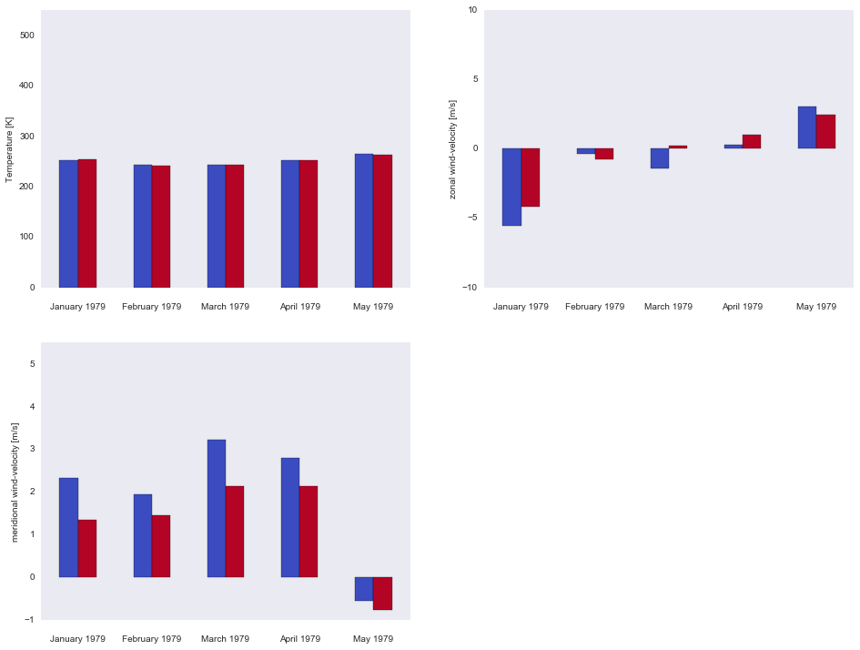

.. _gallery_examples_plotter_simple_example_bar.ipynb:

Bar plot demo
=============

This example shows you how to make a bar plot using the
``psyplot.project.ProjectPlotter.barplot`` method.

.. code:: python

    import psyplot.project as psy

.. code:: python

    axes = iter(psy.multiple_subplots(2, 2, n=3))
    for var in ['t2m', 'u', 'v']:
        psy.plot.barplot(
            'demo.nc',  # netCDF file storing the data
            name=var, # one plot for each variable
            y=[0, 1],  # two bars in total
            z=0, x=0,      # choose latitude and longitude as dimensions
            ylabel="{desc}",  # use the longname and units on the y-axis
            ax=next(axes),
            color='coolwarm', legend=False, xticklabels='%B %Y'
        )
    bars = psy.gcp(True)
    bars.show()

.. code:: python

    bars.close(True, True)

.. only:: html

    .. container:: sphx-glr-download

        **Download python file:** :download:`example_bar.py`

        **Download IPython notebook:** :download:`example_bar.ipynb`

.. only:: html

    .. container:: sphx-glr-download

        **Download supplementary data:** :download:`demo.nc`
