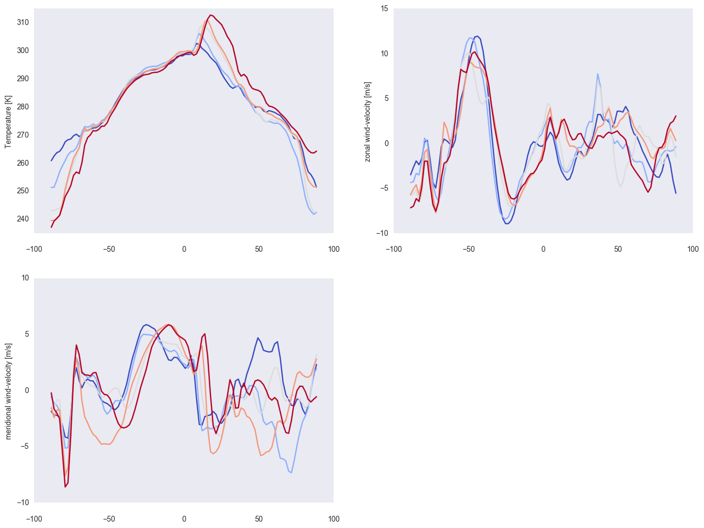

.. _gallery_examples_plotter_simple_example_line.ipynb:

Line plot demo
==============

This example shows you how to make a line plot using the
``psyplot.project.ProjectPlotter.lineplot`` method.

.. code:: python

    import psyplot.project as psy

.. code:: python

    axes = iter(psy.multiple_subplots(2, 2, n=3))
    for var in ['t2m', 'u', 'v']:
        psy.plot.lineplot(
            'demo.nc',  # netCDF file storing the data
            name=var, # one plot for each variable
            t=range(5),  # one violin plot for each time step
            z=0, x=0,      # choose latitude and longitude as dimensions
            ylabel="{desc}",  # use the longname and units on the y-axis
            ax=next(axes),
            color='coolwarm', legend=False
        )
    lines = psy.gcp(True)
    lines.show()

.. code:: python

    lines.close(True, True)

.. only:: html

    .. container:: sphx-glr-download

        **Download python file:** :download:`example_line.py`

        **Download IPython notebook:** :download:`example_line.ipynb`

.. only:: html

    .. container:: sphx-glr-download

        **Download supplementary data:** :download:`demo.nc`
